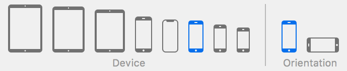
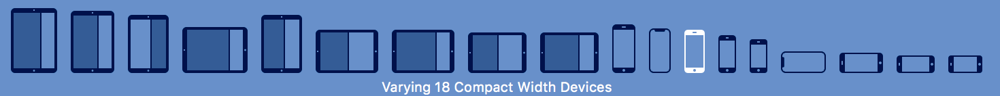
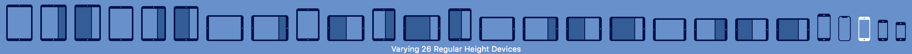
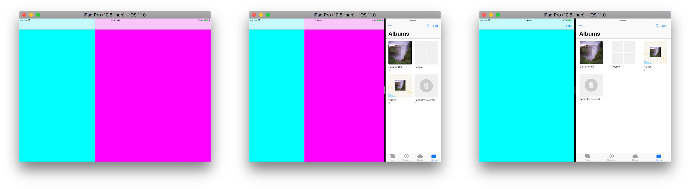

# Building adaptive container view controller

## Adaptivity

UIKit went a long way to support various devices and screen sizes in one app. Starting from universal apps for iPhone and iPad, introducing Auto Layout, multiple iterations on rotation API, and up to adaptive apps. Today's number of devices:



Number of possible screen sizes looks scary:





Applying concept of adaptivity is a must for a modern app.

Adaptivity is a complex process. It includes responsive layout, adaptive presentations, margins, text and fonts, etc.

One of the key concepts is adaptive views. When screen is large enough we want to show complete UI. And if space is limited, we need to make a decision: do we need to adjust layout or hide parts of the screen by changing navigation. Creating adaptive container view controllers allows us to reflect screen size change on navigation structure.

## Container view controllers

Container view controller is simply a view controller that manages other view controllers. Examples in UIKit include `UINavigationController`, `UITabBarController`, and `UISplitViewController`.


## UISplitViewController

Quote from documentation:

> A container view controller that presents a master-detail interface.
> In a master-detail interface, changes in the primary view controller (the master) drive changes in a secondary view controller (the detail). The two view controllers can be arranged so that they are side-by-side, so that only one at a time is visible, or so that one only partially hides the other.

Many iOS apps use split view controller: Mail, Reminders, Notes, ..

Master-detail interface usually implies arranged list of items in the master view controller. The detail view controller displays selected item. On iPhone this interface is represented by the navigation stack: user selects item in the list and the detail screen is pushed to the navigation stack.

## Custom split view controller

There are common cases when view controllers are equal. For instance, when we want different representations for a set of items. This can be map and a list of places or cover flow and a grid of files. `UISplitViewController` is not intended to handle this cases. We need to build custom split view controller and make it adaptable.

## Designing split view controller



#### Display Mode

I want my custom split view controller to support similar display modes:
- both view controllers are displayed at the same time, side-by-side;
- one view controller at a time is displayed.

```swift
enum DisplayMode {
    // Both view controllers are displayed at the same time, side-by-side
    case sideBySide
    // One view controller at a time is displayed
    case one
}

private(set) var displayMode: DisplayMode = .sideBySide
```

Display mode must change when screen size changes. I need to know when screen is large enough for side-by-side presentation. Absolute size in points is not important. I use horizontal size class to decide best display mode.

```swift
/// Suggests display mode based on trait collection
private func suggestDisplayMode(for traitCollection: UITraitCollection) -> DisplayMode {
    return traitCollection.horizontalSizeClass == .regular ? .sideBySide : .one
}
```

#### Switching Focus

When one view controller is displayed, I have two routines to handle. First is transition (flip) between displayed and hidden views. Second is the display mode change. When display mode transitions back and forth, I want to keep previously displayed view controller.

Once more, enum helps to keep track of the state.

```swift
/// Defines visible view controller when one at a time displayed
private enum DisplayFocus {
    /// When .displayMode set to .one, left view is visible
    case left
    /// When .displayMode set to .one, right view is visible
    case right
}

private var displayFocus: DisplayFocus = .left
```

#### Layout

In side-by-side mode my split view controller will divide available area into two columns. The left column will occupy fixed space. And I want it to reflect screen size. Therefore, when my screen is wider than taller, the left column will ocupty slightly more space.

I'm deliberately avoid using landscape and portrait terms. Layout should not depend on device orientation.

```swift
/// Width of the left view in side-by-side display mode
private var leftColumnWidth: CGFloat!

/// Suggests width of the left column in side-by-side display mode
private func suggestLeftColumnWidth(for availableSize: CGSize) -> CGFloat {
    return availableSize.width > availableSize.height ? 440.0 : 320.0
}   
```

`ContainerView` helps me manage positioning of views without constraints.

```swift
private class ContainerView: UIView {

    var contentView: UIView? {
        willSet {
            contentView?.removeFromSuperview()
        }

        didSet {
            guard let contentView = contentView else { return }
            addSubview(contentView)
        }
    }

    override func layoutSubviews() {
        super.layoutSubviews()
        contentView?.frame = bounds
    }
}

private var leftContainerView: ContainerView!
private var rightContainerView: ContainerView!
```

Frame calculations are separated in a set of functions.

```swift
    private func fullFrame(for availableSize: CGSize) -> CGRect
    private func fullLeftFrame(for availableSize: CGSize) -> CGRect
    private func fullRightFrame(for availableSize: CGSize) -> CGRect
    private func leftColumnFrame(for availableSize: CGSize) -> CGRect
    private func rightColumnFrame(for availableSize: CGSize) -> CGRect
```

Creating separate functions eliminates boilerplate code, allows me to easily change calculation logic, and implement additional features. For instance, frame calculation functions implement RTL support.

```swift
private func leftColumnFrame(for availableSize: CGSize) -> CGRect {
    switch traitCollection.layoutDirection {
        case .unspecified, .leftToRight:
            return CGRect(x: 0.0, y: 0.0, width: leftColumnWidth, height: size.height)
        case .rightToLeft:
            return CGRect(x: size.width - leftColumnWidth, y: 0.0, width: leftColumnWidth, height: size.height)
    }
}
```

## Implementing container view controller

Implementing a container view controller implies establishing relationship between a container view controller and its child view controllers. UIKit forwards various events through chain of responder objects. This happens under the hood. But we must make sure child view controllers are part of it. 

To establishing relationship we need:

>1. Call the `addChildViewController:` method of your container view controller.
This method tells UIKit that your container view controller is now managing the view of the child view controller.
>2. Add the child’s root view to your container’s view hierarchy.
Always remember to set the size and position of the child’s frame as part of this process.
>3. Add any constraints for managing the size and position of the child’s root view.
>4. Call the `didMoveToParentViewController:` method of the child view controller.

```swift
    var leftViewController: UIViewController? {
        willSet {
            guard let child = leftViewController else { return }
            child.willMove(toParentViewController: nil)
            child.view.removeFromSuperview()
            child.removeFromParentViewController()
        }

        didSet {
            guard let child = leftViewController else { return }

            loadViewIfNeeded() // Make sure the view is loaded

            addChildViewController(child)
            child.view.frame = leftContainerView.bounds
            leftContainerView.contentView = child.view // Layout managed by container view
            child.didMove(toParentViewController: self)
        }
    }
```

This steps described in detail in View Controller Programming Guide for iOS - [Implementing a Container View Controller](https://developer.apple.com/library/content/featuredarticles/ViewControllerPGforiPhoneOS/ImplementingaContainerViewController.html#//apple_ref/doc/uid/TP40007457-CH11-SW1).

### Implementing adaptive view controller

There are couple of methods in `UIViewController` that reflect adaptivity.

`UIViewController` receives `viewWillLayoutSubviews` callback when layout of its view is about to change. This is good time to manipulate things.

```swift
override func viewWillLayoutSubviews() {
    super.viewWillLayoutSubviews()

    // Update display state
    displayMode = suggestDisplayMode(for: traitCollection)
    
    let size = view.bounds.size

    switch displayMode {
        case .sideBySide:
            // Add subviews. Order is not important
            view.addSubview(leftContainerView)
            view.addSubview(rightContainerView)

            // Update left column width
            leftColumnWidth = suggestLeftColumnWidth(for: size)
            
            // Position container views
            leftContainerView.frame = leftColumnFrame(for: size)
            rightContainerView.frame = rightColumnFrame(for: size)

        case .one:
            // Add/remove subviews based on display focus
            switch displayFocus {
                case .left:
                    view.addSubview(leftContainerView)
                    leftContainerView.frame = fullFrame(for: size)
                    rightContainerView.removeFromSuperview()
                case .right:
                    view.addSubview(rightContainerView)
                    rightContainerView.frame = fullFrame(for: size)
                    leftContainerView.removeFromSuperview()
            }
    }
}
```

When overriding `viewWillLayoutSubviews` it is important to be careful not to create a layout cycle.

There are two methods to reflect changes in screen/view size:
- `viewWillTransition(to:with:` called when size of the view will change.
- `willTransition(to:with:)` called when trait collection will change.

Because my display mode changes based on size class, I need to update UI in `willTransition(to:with:)`.

```swift
override func willTransition(to newCollection: UITraitCollection, with coordinator: UIViewControllerTransitionCoordinator) {
    super.willTransition(to: newCollection, with: coordinator)
    
    coordinator.animate(alongsideTransition: nil) { _ in
        switch displayMode {
            case .sideBySide:
                navigationItem.rightBarButtonItem = nil
                break
            case .one:
                navigationItem.rightBarButtonItem = UIBarButtonItem(title: "Flip", style: .plain,
                    target: self, action: #selector(flipAction))
                break
        }
    }
}
```

As you can see, creating adaptive view controller is not hard and it doesn't take much code/time.

## Key takeaways

- Reflect adaptivity on layout and presentation;
- Establish relationship between a container view controller and its child view controllers;
- Reflect changes in `viewWillLayoutSubviews`;
- Do not forget about localization and RTL support;
- **Build adaptable apps!**

Thank you for reading. Full code is in the repository. Feel free to play with it or use it in real apps.

More information:
- [Making Apps Adaptive, Part 1](https://developer.apple.com/videos/play/wwdc2016/222)
- [Making Apps Adaptive, Part 2](https://developer.apple.com/videos/play/wwdc2016/233)


